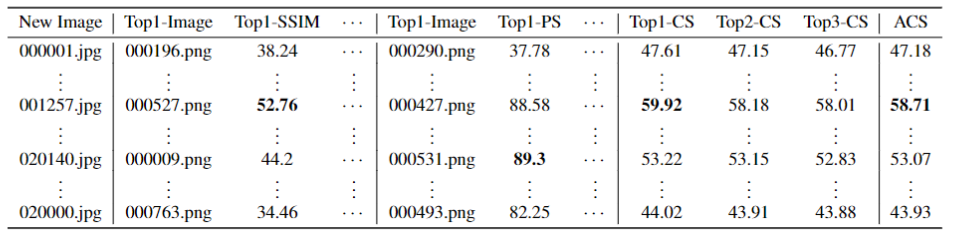

# <h1 align="center"> SG-LRA: Self-Generating Automatic Scoliosis Cobb Angle Measurement with Low-Rank Approximation </h1> 

    

The project is about the Spinal-AI2024 dataset of spinal scoliosis X-ray images, which is to be publicly released by the paper [CurvNet: Latent Contour Representation and Iterative Data Engine for Curvature Angle Estimation](https://arxiv.org/abs/2411.12604). The dataset generation process is detailed in the paper.

## Introduction
The project is about the Spinal-AI2024 dataset of spinal scoliosis X-ray images, which is to be publicly released by the paper SG-LRA. The dataset generation process is detailed in the paper.

The Spinal-AI2024 dataset contains a total of 20,000 spinal scoliosis X-ray images generated by the SG-LAR framework. It is divided into 5 subsets, with 4,000 images in each subset (subset1-subset5). It is recommended to use subset1-subset4, with a total of 16,000 images, as the training set, and subset5 as the test or evaluation set.

Following this partition, COCO format annotation files, Spinal-AI2024_train.json and Spinal-AI2024_test.json, are provided.

The imag_similarity_checklist.xlsx file contains the similarity assessment between each generated image and the original dataset, as mentioned in the paper.

The Cobb_spinal-AI2024-test_gt.txt and Cobb_spinal-AI2024-train_gt.txt files contain the annotations of the three Cobb angles for each image.

